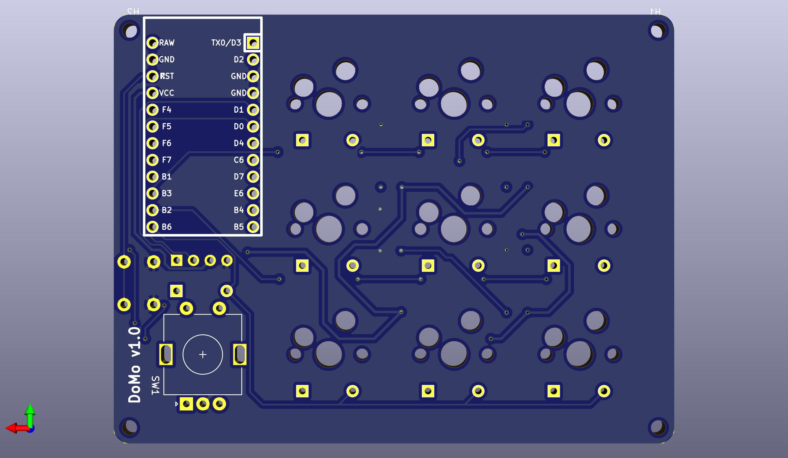
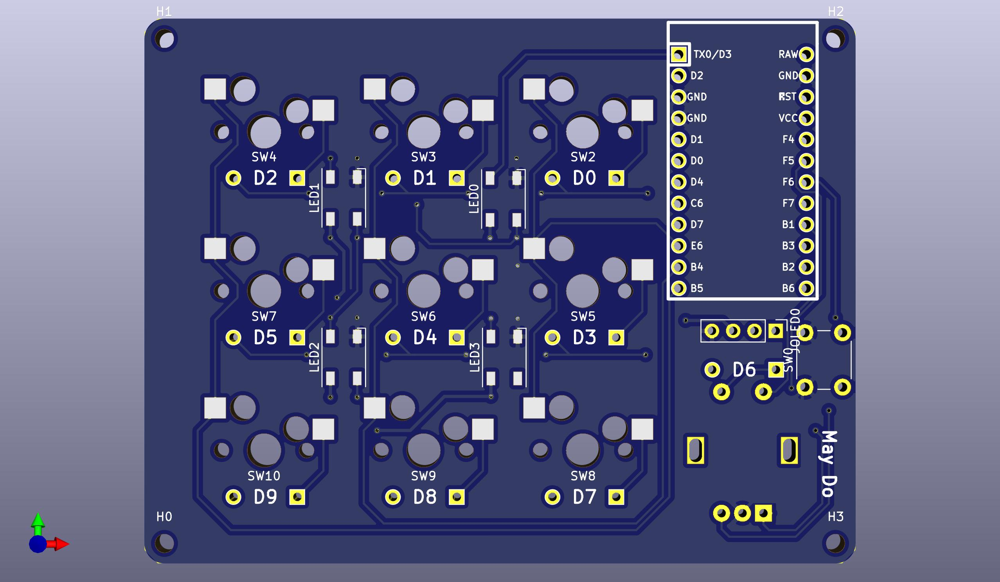

# DoMo Macro Pad

DoMo is a 3x3 macro pad with a rotary encoder and OLED display.

It's a straightforward design with a straightforward idea. I originally designed this for myself to provide quick access to most commonly used keys especially for programming. That means the top priority were to include shortcuts for copy and paste! However this can also be used just as any other macro pads for media controls to help improve workflow.

## Features

- QMK Firmware Support
- MX Hot Swap
- OLED Screen
- Rotary Encoder
- LEDS

## Assembly 
Note that source files only covers the PCB. Components must be assembled in order for the board to be used or completed.
| Number of Parts | Component | Required |
| ------------- | ------------- | ------------- |
| 1 | Reset Switch |:heavy_check_mark: |  
| 9 | MX switches |:heavy_check_mark: |  
| 9 | Keycaps |:heavy_check_mark: |  
| 1 | USB Cable  |:heavy_check_mark: | 
| 9 | Diodes |:heavy_check_mark: | 
| 1 | Pro Micro or Equivalent |:heavy_check_mark: |  
| 1 | Bottom Plate |:heavy_check_mark: |  
| 4 | Standoffs |:heavy_check_mark: |  
| 4 | Screws |:heavy_check_mark: |  
| 4 | LEDS |
| 9 | Kailh MX Sockets |
| 1 | Rotary Encoder |
| 1 | OLED Display |
